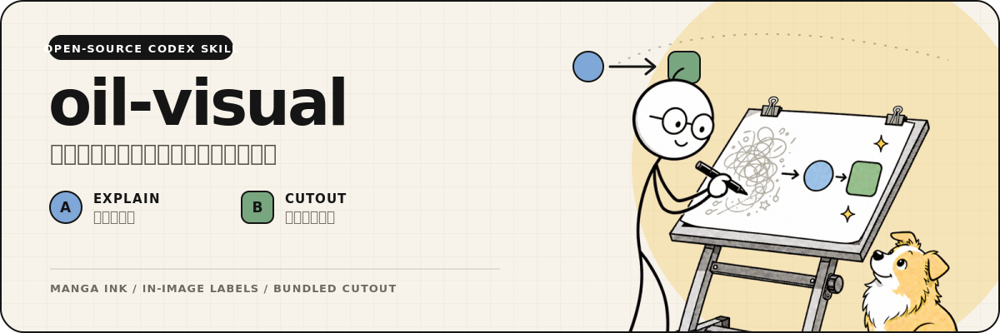
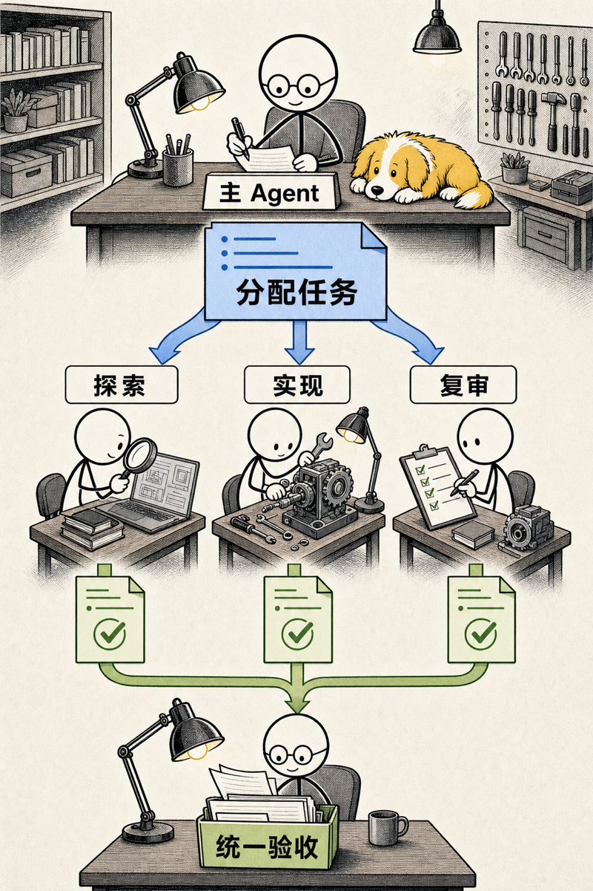
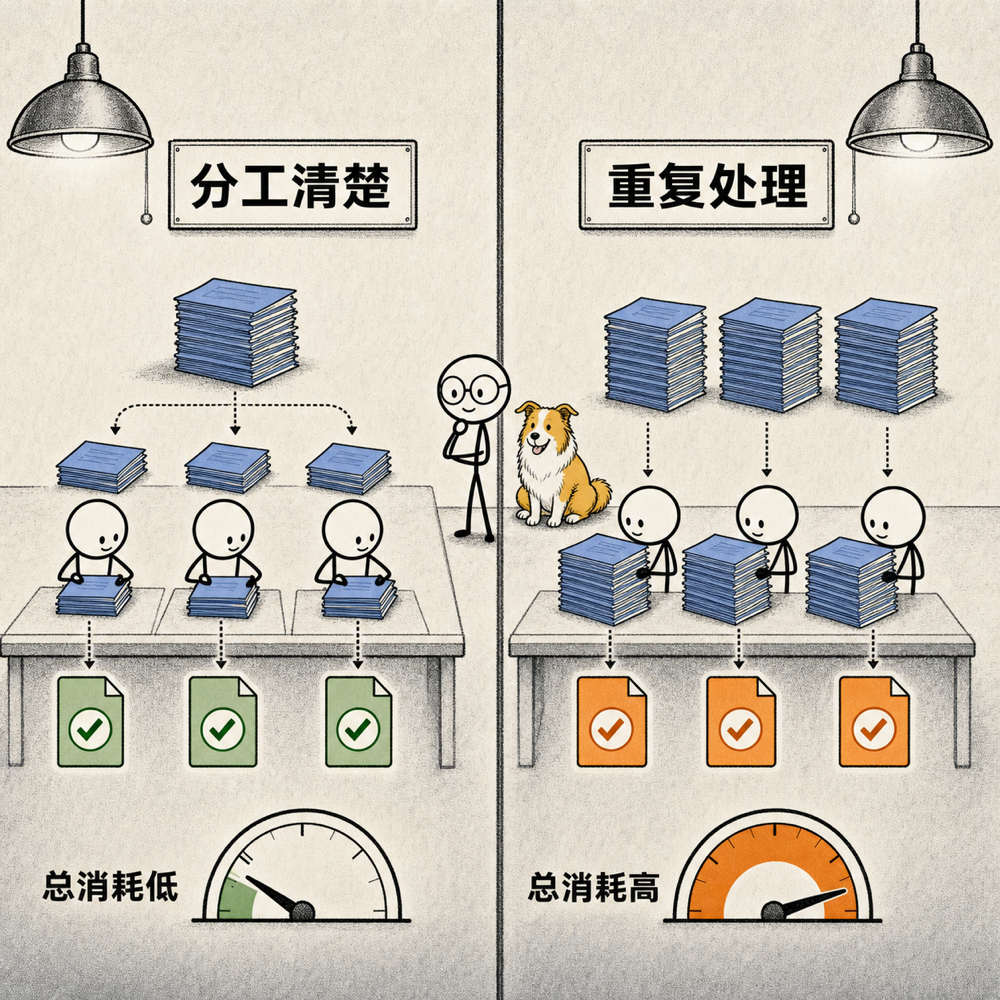
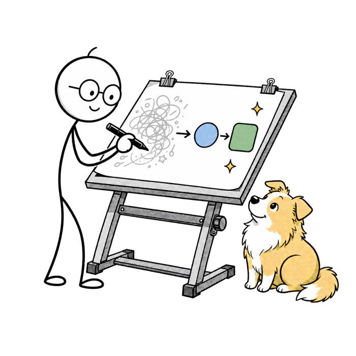

<p align="center">
  
</p>

`oil-visual` 是一个 Codex Skill，用同一套漫画墨线、半调网点、小人和黄色边牧，完成两种不同的视觉任务：

- **完整解释图**：用真实物体、流程关系和图片内文字讲清一个概念。
- **透明角色插画**：先生成纯色背景素材，再用仓库内置脚本抠成透明 PNG。

## 看实际结果

<p align="center">
  
  
</p>

上面两张图都由图片本身承担解释。标题和标签在生成图片时直接写入，并在交付前逐字检查。

<p align="center">
  
</p>

透明插画使用高对比纯色背景生成，再由 `scripts/cutout.py` 自动采样边框颜色、生成软透明边缘，并清理抗锯齿中的键控色。

## 两种模式怎么选

| 模式 | 适合的任务 | 最终文件 |
| --- | --- | --- |
| Mode A · Explain | 概念、机制、流程、比较、取舍 | 带完整场景和准确标签的 PNG／WebP |
| Mode B · Cutout | Hero、文档配图、卡片、可复用角色素材 | 透明 PNG |

一张图只选择一种模式。图片需要独立讲清内容时使用 Mode A；标题和正文由外部版面承担时使用 Mode B。

## 安装

```bash
git clone https://github.com/oil-oil/oil-visual.git ~/.codex/skills/oil-visual
```

重启 Codex，然后在对话里点名使用：

```text
Use $oil-visual to explain why subagents can save time but sometimes increase cost.
Generate one finished image with exact Chinese labels.
```

```text
Use $oil-visual to create a transparent hero illustration of a person reviewing
a diagram with the warm-yellow Border Collie.
```

## 透明抠图

Mode B 需要 Python 3 和 [Pillow](https://pillow.readthedocs.io/)：

```bash
python3 -m pip install Pillow
python3 scripts/cutout.py source.png transparent.png
```

脚本默认从图片边框采样键控色，因此可以使用绿色、洋红色或其他没有出现在主体里的纯色背景。遇到边缘过软或过硬时，可以调整：

```bash
python3 scripts/cutout.py source.png transparent.png \
  --transparent-threshold 12 \
  --opaque-threshold 220
```

## 仓库内容

```text
SKILL.md                    Skill 的完整工作规则
agents/openai.yaml          Codex 中显示的名称和默认提示词
scripts/cutout.py           透明抠图脚本
examples/                   两种模式的真实结果
assets/readme/hero.svg      GitHub 首页视觉
```

## License

[MIT](./LICENSE)
