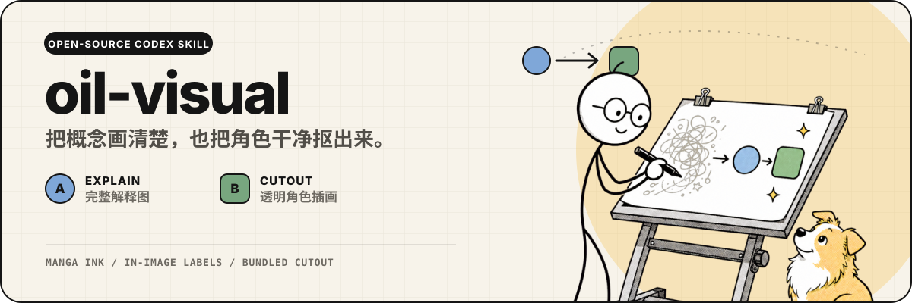
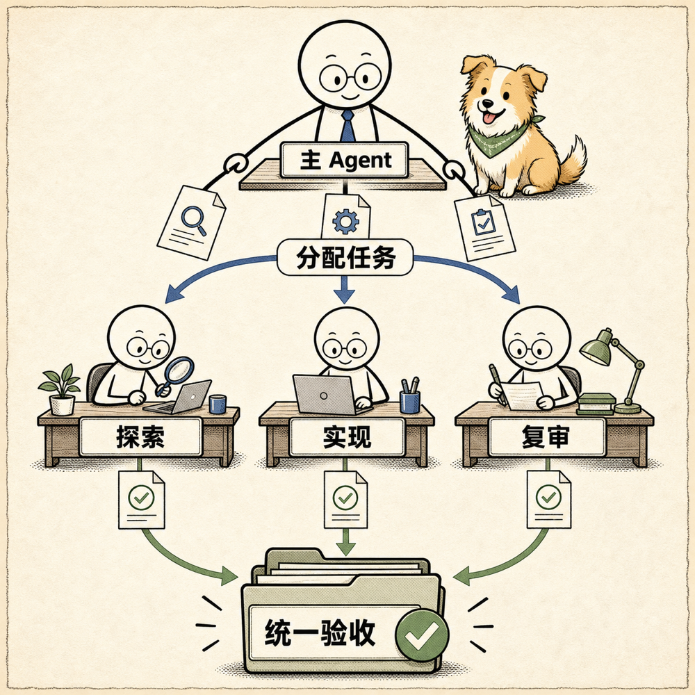
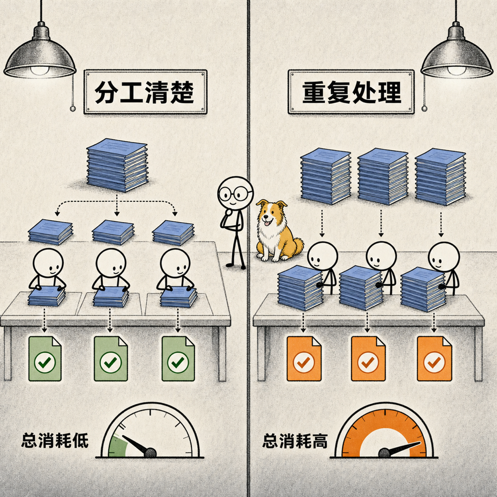
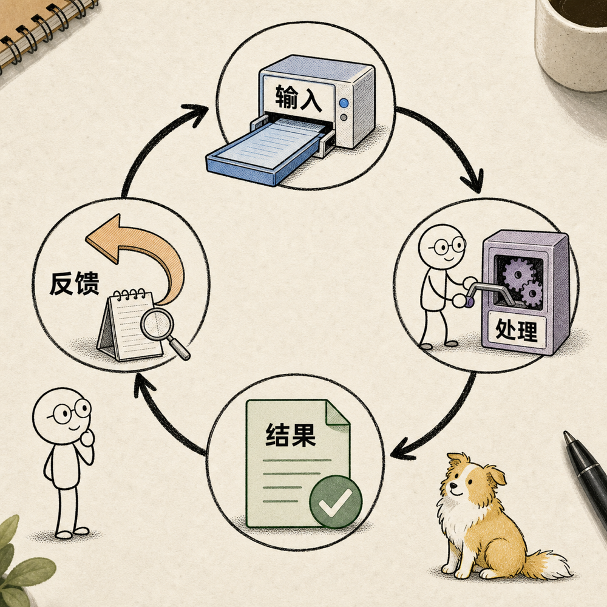
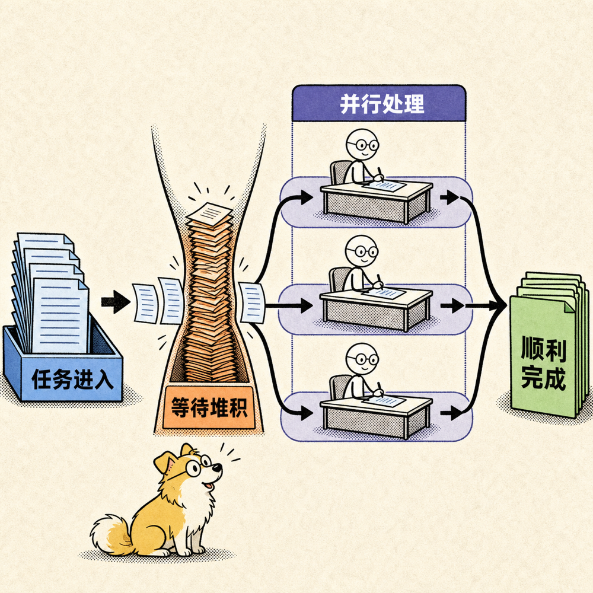
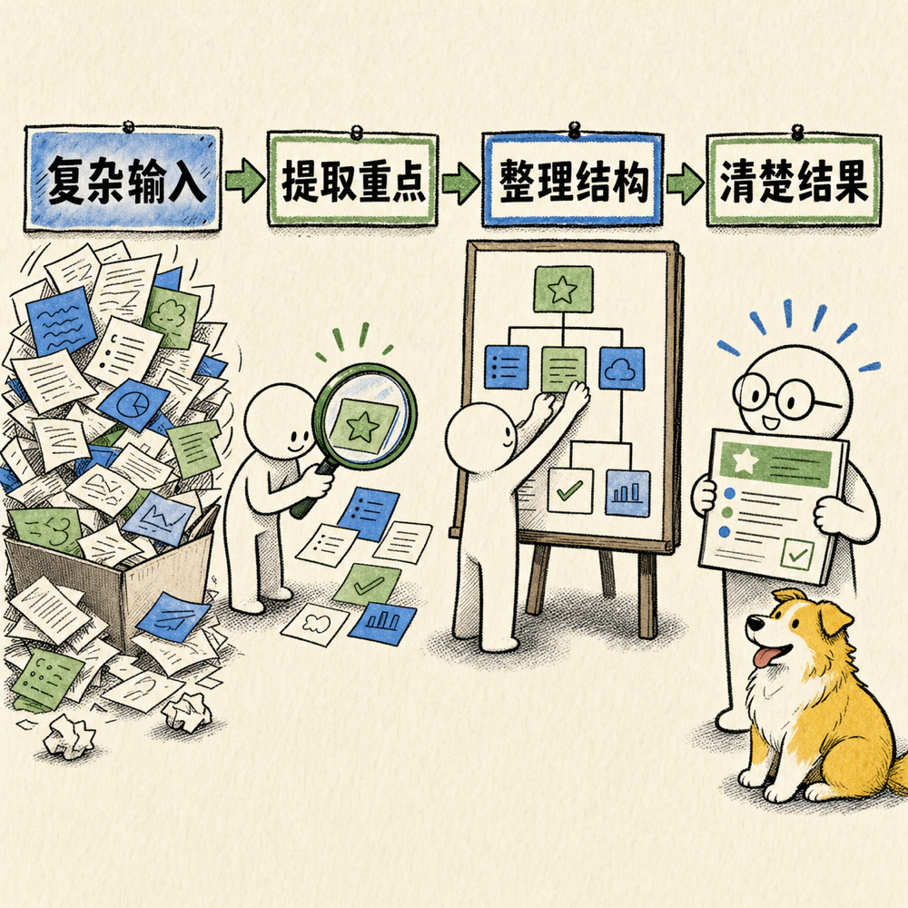

<p align="center">
  
</p>

制作统一漫画墨线风格的解释图与透明角色插图，用于概念、流程、比较和文章配图。

适合用来画概念解释、机制流程、对比关系和角色场景。

## 配图风格

- 用粗细分明的黑色墨线画轮廓和细节。
- 用圆形半调网点表现灰面和阴影，不使用柔和渐变。
- 主角是戴圆框眼镜的极简小人，旁边保留一只胖胖的暖黄色边牧。
- 场景使用米白色纸张质感，只保留少量真正帮助理解的环境物件。
- 暖黄色是固定颜色；每张图最多再使用两种语义色。
- 图片需要文字时，使用短而准确的无衬线标签，并直接放在对应物体上。

## 示例

<p align="center">
  
  
  
</p>

<p align="center">
  
  
</p>

同一套小人、边牧、墨线、网点和语义色，可以表现机制、对比、循环、瓶颈和信息整理。

## 安装

```bash
npx skills add oil-oil/oil-visual
```

让当前宿主重新加载 Skill，然后在对话里点名使用：

```text
Use $oil-visual to explain how the main Agent assigns work to subagents.
Use short, exact Chinese labels inside the image.
```

```text
Use $oil-visual to draw the glasses stick figure reviewing a blueprint,
with the warm-yellow Border Collie sitting beside the desk.
```

完整规则、提示词结构和交付检查都写在 [`SKILL.md`](./SKILL.md) 里。

## License

[MIT](./LICENSE)

## 配置、依赖与使用边界

需要宿主可用的生图与读图能力；透明插图另需 Python 和 Pillow 运行 cutout.py。无额外账号硬性要求，费用与凭据由所选生图供应商决定。

提示词与参考图会交给已选生图工具；图片中的文字与透明边缘必须检查。密集正文、可编辑图表应使用确定性排版工具。

使用示例：

```text
用 oil-visual 画一张解释反馈循环的图，中文短标签。
```

## GitHub 安装

把 [仓库地址](https://github.com/oil-oil/oil-visual) 交给 Agent，要求按 README 安装；也可运行：

```bash
npx skills add oil-oil/oil-visual
```

安装后由宿主重新加载 Skill。
