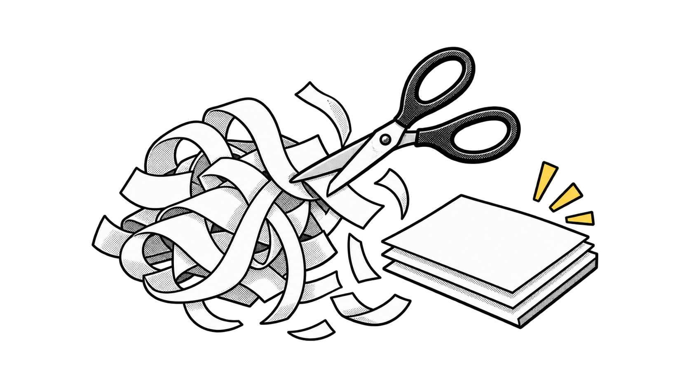

<p align="center">
  
</p>

用同一套漫画墨线风格，制作两类可直接使用的图片：一类是带短标签、能独立讲清概念或流程的完整解释图；另一类是可放进演示稿、文章或卡片的透明插画素材。

透明素材可以只画戴眼镜的小人、暖黄色边牧、两者组合，也可以只画文件夹、工具等物件。角色按画面需要出现，物件不必靠加一个人或一只狗来维持风格。

## 配图风格

- 用粗细分明的黑色墨线画轮廓和细节。
- 用圆形半调网点表现灰面和阴影，不使用柔和渐变。
- 戴圆框眼镜的极简小人和胖胖的暖黄色边牧是可选角色，可以单独出现、一起出现，或都不出现。
- 物件与装饰元素沿用同一套轮廓、墨线、网点和克制配色，不自动添加角色。
- 完整解释图使用米白色纸张质感，只保留少量真正帮助理解的环境物件；独立插画交付透明背景。
- 狗出现时使用暖黄色；没有狗时，暖黄色可作为少量点缀，也可以不用。每张图最多再使用两种语义色。
- 图片需要文字时，使用短而准确的无衬线标签，并直接放在对应物体上。

## 示例

### 完整解释图

<p align="center">
  
  
  
</p>

<p align="center">
  
  
</p>

同一套墨线、网点和语义色，可以表现机制、对比、循环、瓶颈和信息整理。

### 透明插画素材

<p align="center">
  
  
</p>

两张都是原始透明 PNG：左图用放大镜和文件夹表现“定位”，右图用剪刀和纸张表现“精简”。它们只包含物件，没有人物、狗、文字或整页背景。

## 安装

把 [oil-visual 仓库地址](https://github.com/oil-oil/oil-visual) 交给 Agent，要求安装这个 Skill；也可以使用命令：

```bash
npx skills add oil-oil/oil-visual
```

让当前宿主重新加载 Skill，然后在对话里点名使用：

```text
Use $oil-visual to explain how the main Agent assigns work to subagents.
Use short, exact Chinese labels inside the image.
```

```text
Use $oil-visual to draw the glasses stick figure reviewing a blueprint,
with the warm-yellow Border Collie sitting beside the desk.
```

```text
用 oil-visual 画一个单独拿着铅笔的小人，透明背景，不要狗。
用 oil-visual 画一只单独坐着的暖黄色边牧，透明背景，不要人物。
用 oil-visual 画一个同风格的文件夹和几张散开的纸，透明背景，不要人物或狗。
用 oil-visual 画几颗同风格的星芒装饰元素，透明背景，不要角色。
```

完整规则、提示词结构和交付检查都写在 [`SKILL.md`](./SKILL.md) 里。

## License

[MIT](./LICENSE)

## 配置、依赖与使用边界

无需额外配置，但需要宿主具备生图和读图能力。生图工具能直接输出透明 PNG 时保留原生透明通道；只能输出纯色背景时，用附带的 `cutout.py` 抠图，这条备用路径需要 Python 和 Pillow。费用与凭据取决于所选生图工具。

提示词与参考图会交给所选生图工具。交付前应检查图片中的短标签和透明边缘；密集正文、可编辑图表应使用确定性排版工具。
